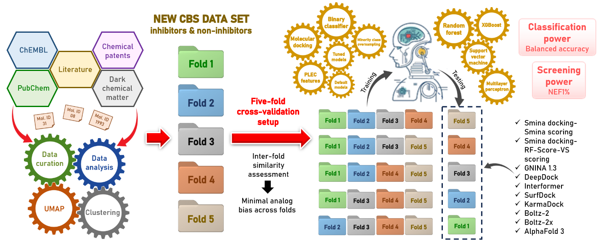

# Enhancing Virtual Screening of Cystathionine β-Synthase Inhibitors: Benchmarking Target-Specific Machine-Learning Scoring Functions Against State-of-the-Art AI Docking and Co-Folding Approaches 

Cystathionine beta-synthase (CBS) has emerged as an important therapeutic target implicated in cancer and Down syndrome, yet the discovery of selective CBS inhibitors remains challenging due to limited structural diversity of known ligands and the scarcity of target-focused virtual screening (VS) benchmarks. In this study, we benchmarked the first comprehensive evaluation of CBS-specific machine-learning (ML) models against a diverse panel of 16 established VS pipelines, including classical docking-based scoring schemes, modern deep-learning (DL) docking tools, and recent co-folding approaches for protein-ligand modeling and affinity prediction. 

Our CBS-specific ML models demonstrated consistently high screening power and robust classification performance, and they substantially outperformed these state-of-the-art (SOTA) methods in early enrichment, highlighting the advantage of target-focused training for VS tasks. Our results further reveal that generic DL docking and co-folding approaches struggle to achieve reliable screening performance when applied to targets that are under-represented in or entirely absent from their training data, as appears to be the case for CBS. This underscores a key limitation of broadly trained foundation-style models in prospective drug discovery campaigns involving less-studied proteins. 

## Table of Contents
- [Workflow](#Workflow)
- [Dataset](#Dataset)
- [Installation](#Installation)
- [Running CBS-specific models](#Running)
- [Contact](#Contact)

<a id="set-up"></a>

## Workflow
<a id="Workflow"></a>


## Dataset
<a id="Dataset"></a>
Inside `data/` directory, you will find:
- `raw_data/Final_data.csv`: Our initial dataset with 10,445 compounds (43 true active, 195 true inactive, and 10,207 dark chemical matter (DCM) compounds) with corresponding SMILES, cluster IDs, and fold IDs
- `raw_data/Fold_{x}.csv`: Performance of 32 VS pipelines on each fold
- `figure_data/`: raw data to generate figure in our manuscript
- `raw_data/raw_SOTA_results`: This folder contains raw outputs from Interformer (20 poses per compound) and SurfDock (40 poses per compound)
- `Template/`: This folder contains processed experiment structure of CBS protein (PDB ID 7QGT) and co-crystallized ligand
- `PLEC/`: This folder contains PLEC fingerprints for 10,445 compounds in our dataset
- `umap_split/`: This folder contains UMAP coordinates generated by applying dimensionality reduction to Morgan fingerprints (radius 2, 1024 bits).

All the inputs and outputs used to reproduce the results from our paper can be found in: [**Zenodo**](https://zenodo.org/records/18743776).

Inside `models/` directory, you will find:
- `hyperparameter`: This folder contains optimal hyperparameters and decision threshold obtained from Optuna optimization process.
Hyperparameters can be obtained by running:
```
python -c "import joblib; study=joblib.load('name_of_the_study.pkl'); print(study.best_params)"
```
Decision thresholds can be obtained by running:
```
tail -n 1 models/hyperparameter/*/*/*.txt
```
- `model`: This folder contains CBS-specific models used for inference. For example: `SVC_optuna_over_1_model.pkl` is SVC model trained using Optuna for hyperparameter tuning on oversampled training folds 2, 3, 4, and 5, and tested on fold 1.

## Installation
<a id="Installation"></a>
This code was tested with Python 3.12.12 on Ubuntu 24.04.3 LTS

Installation of [Open Babel](https://openbabel.org/docs/ReleaseNotes/ob310.html). Our code was tested with Open Babel (v.3.1.0).
```
#Update the package index
sudo apt update        
#Install the necessary dependencies
sudo apt install build-essential cmake git libcairo2-dev libeigen3-dev libffi-dev libfreetype6-dev libpng-dev libpython3-dev libxml2-dev python3 python3-dev python3-pip python3-pyqt5 python3-pyqt5.qtsvg python3-setuptools qtbase5-dev zlib1g-dev

git clone https://github.com/openbabel/openbabel.git
cd openbabel
git checkout tags/openbabel-3-1-0
mkdir build
cd build
cmake ..
make
sudo make install

#Verify the installation
obabel --version
```

Installation of CBS environment
```
cd ~/
git clone https://github.com/caominhtr/CBS.git
cd CBS
conda env create -f CBS.yaml
conda activate CBS
```

## Running our CBS-specific models
<a id="Running"></a>
To perform inference using our CBS-specific models, the following steps should be followed:
### Step 1: Input preparation
The example of dataset in `.smi` format can be found at `data/example.smi`. Each row corresponds to a SMILES string with its ID. Inputs can also be prepared in `.csv` or `.txt` formats.

### Step 2: Running inference
```
python tools/infer.py -f path/to/SMILES/inputs -o path/to/output/directory
```
### Step 3: Results
Column `{X}_{Y}_{i}_prob` contains probability predicted by model using algorithm {X} with variant {Y} (Default, tuning only, oversampling only, and both tuning and oversampling), trained on four folds except for fold {i}. 

Column `{X}_{Y}_{i}_label` contains corresponing predicted labels based on optimal decision threshold.

## Contact
<a id="Contact"></a>
For further queries, please contact: 
- Cao-Minh Truong (cao-minh.truong@etu.u-paris.fr, caominh.truong0306@gmail.com)
- Dr. Viet-Khoa Tran-Nguyen (viet-khoa.tran-nguyen@u-paris.fr)
- Pr. Olivier Taboureau (olivier.taboureau@u-paris.fr)

---------------------------------------------------------------------------------------------------------------------------------------------------
This work was carried out at the Unité de Biologie Fonctionnelle et Adaptative (BFA), INSERM U1133, CNRS UMR8251, Université Paris Cité, France. The latest version of all data and source code provided herein was updated and made available free of charge in February 2026, and is subject to copyright.
